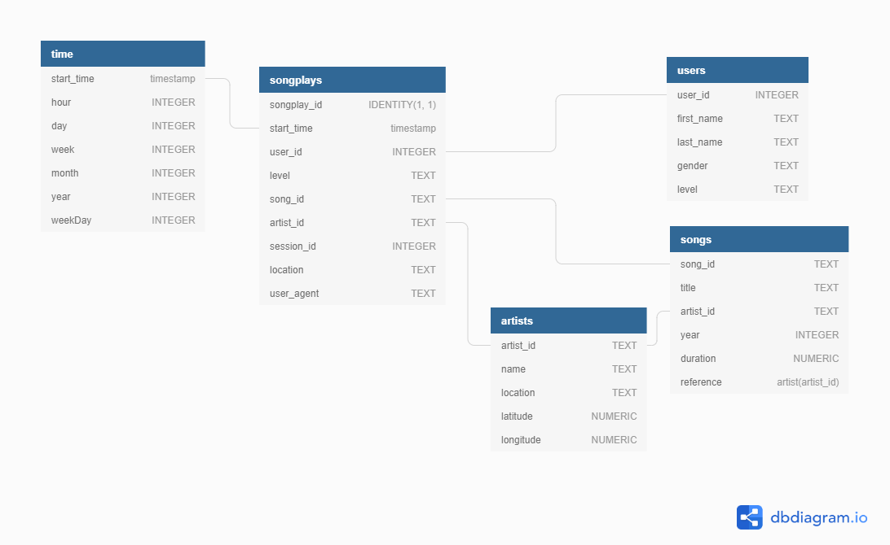

# Data Warehouse with AWS Redshift


## **Purpose of the Data Warehouse**

This project aims to create a Redshift database to support the analytics team to find insights into their users' songs.
The data is stored in S3 in .json format, so it is required to extract it and load it in the stage area, and afterward, it is transformed and loaded in the fact and dimensions tables.


## **Dataset**

### Song Dataset
Songs dataset is a subset of [Million Song Dataset](http://millionsongdataset.com/).

Sample Record :
```
{"num_songs": 1, "artist_id": "ARJIE2Y1187B994AB7", "artist_latitude": null, "artist_longitude": null, "artist_location": "", "artist_name": "Line Renaud", "song_id": "SOUPIRU12A6D4FA1E1", "title": "Der Kleine Dompfaff", "duration": 152.92036, "year": 0}
```

### Log Dataset
Logs dataset is generated by [Event Simulator](https://github.com/Interana/eventsim).

Sample Record :
```
{"artist": null, "auth": "Logged In", "firstName": "Walter", "gender": "M", "itemInSession": 0, "lastName": "Frye", "length": null, "level": "free", "location": "San Francisco-Oakland-Hayward, CA", "method": "GET","page": "Home", "registration": 1540919166796.0, "sessionId": 38, "song": null, "status": 200, "ts": 1541105830796, "userAgent": "\"Mozilla\/5.0 (Macintosh; Intel Mac OS X 10_9_4) AppleWebKit\/537.36 (KHTML, like Gecko) Chrome\/36.0.1985.143 Safari\/537.36\"", "userId": "39"}
```


## **Database schema**



### Fact Table 
**songplays** - records in log data associated with song plays i.e. records with page `NextSong`

```
songplay_id, start_time, user_id, level, song_id, artist_id, session_id, location, user_agent
```

###  Dimension Tables
**users**  - users in the app
```
user_id, first_name, last_name, gender, level
```
**songs**  - songs in music database
```
song_id, title, artist_id, year, duration
```
**artists**  - artists in music database
```
artist_id, name, location, latitude, longitude
```
**time**  - timestamps of records in  **songplays**  broken down into specific units
```
start_time, hour, day, week, month, year, weekday
```


## **ETL pipeline**


```sql_queries.py``` -> Contains SQL queries for dropping and creating fact and dimension tables. Also, it has an insertion query template.

```create_tables.py``` -> Contains code for setting up tables. Running this file creates staging, dimension, and fact tables according to the queries on '''_queries.py**'''

```etl.ipynb``` -> Runs the process to extract files from S3 to the stage area and after that insert them into the fact and dimension tables.


## **How to run**

The notebook “Data Werehouse AWS Redshift.ipynb”  orchestrate all the process.
It is divided in 5 sessions: 
1. AWS SDK - Infrastructure-as-code (IaC)
2. Create Tables
3. ETL
4. Run Analytical Queries
5. Clean up resources
